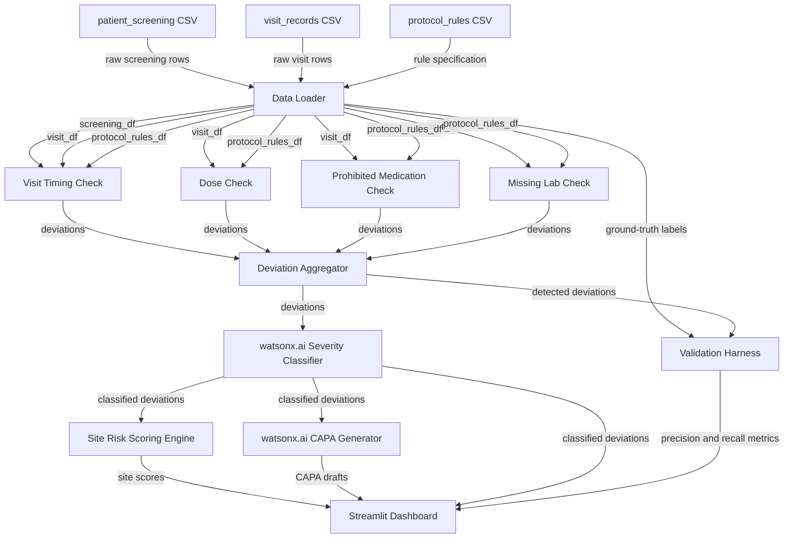

# TrialGuard — System Architecture

## 1. Overview

TrialGuard ingests synthetic clinical trial data for protocol TG-101 — comprising patient screening records, per-visit compliance records, and a machine-readable protocol rule specification — and applies a two-stage processing pipeline to surface protocol deviations in real time. In the first stage a deterministic rule engine evaluates every visit record against four explicit protocol checks (visit timing windows, administered dose, prohibited concomitant medication, and required laboratory tests), producing a structured list of deviations with their type, affected patient, and site. In the second stage IBM watsonx.ai Granite classifies each detected deviation as Major, Minor, or Administrative using few-shot prompting anchored to ICH E6(R2) GCP definitions and the protocol's own classification rules. Site-level risk scores are then calculated from the weighted deviation counts, and watsonx.ai generates a structured CAPA (Corrective and Preventive Action) draft for each deviation. The complete output — deviation table, site risk heatmap, and CAPA drafts — is presented in a Streamlit dashboard.

The core design decision is a **hybrid deterministic rule engine + LLM classification architecture**, and this choice is deliberate. A pure-LLM system cannot be audited: regulators cannot inspect the reasoning chain, results are non-deterministic across runs, and there is no formal specification against which outputs can be validated. By contrast, TrialGuard's rule engine is a direct mechanical translation of the TG-101 protocol specification into code — every deviation it flags can be traced to a specific numbered rule row in `trialguard_protocol_rules.csv`. The LLM layer is used only where it adds value without undermining auditability: severity classification and natural-language CAPA drafting, both of which are downstream of the deterministic detection step and can be overridden by a clinical monitor. Crucially, the rule engine is validated against ground-truth `Deviation_Severity` labels shipped in the dataset, producing precision and recall metrics that can be submitted as evidence of analytical validity — exactly what an FDA 21 CFR Part 11 review or ICH E6(R2) audit would require.

---

## 2. Architecture Diagram



---

## 3. Component Table

| Component | File Path | Responsibility | Depends On | Technology |
|---|---|---|---|---|
| Data Loader | `src/data/loader.py` | Reads the three CSV files into DataFrames; joins visit records with screening data on Patient_ID | `trialguard_patient_screening.csv`, `trialguard_visit_records.csv`, `trialguard_protocol_rules.csv` | Python, Pandas |
| Visit Timing Check | `src/rules/check_visit_timing.py` | Flags any visit where `Actual_Day_From_Enrollment` falls outside the protocol window for that Visit_ID | Data Loader, protocol_rules_df | Python, Pandas |
| Dose Check | `src/rules/check_dose.py` | Flags any visit where `Actual_Dose_mg` ≠ `Protocol_Dose_mg` (100 mg per TG-101) | Data Loader | Python, Pandas |
| Prohibited Medication Check | `src/rules/check_prohibited_med.py` | Flags any visit where `Prohibited_Drug_X` is recorded as administered | Data Loader | Python, Pandas |
| Missing Lab Check | `src/rules/check_missing_lab.py` | Flags any V2 or V4 visit where `CBC_Completed` or `Chemistry_Panel_Completed` is false despite being required | Data Loader, protocol_rules_df | Python, Pandas |
| Deviation Aggregator | `src/rules/aggregator.py` | Combines outputs of all four rule checks into a single deviations DataFrame with a consistent schema | All four rule checks | Python, Pandas |
| Severity Classifier | `src/classifier/severity_classifier.py` | Sends each deviation to IBM watsonx.ai Granite with a few-shot ICH E6(R2) prompt; returns Major / Minor / Administrative | Deviation Aggregator, watsonx.ai API | Python, `ibm-watson-machine-learning` |
| Site Risk Scoring Engine | `src/scoring/risk_scorer.py` | Applies the weighted risk formula per site; assigns Low / Medium / High / Critical band | Severity Classifier output | Python, Pandas |
| CAPA Generator | `src/capa/capa_generator.py` | Prompts watsonx.ai Granite to draft a structured CAPA (Problem, Corrective Action, Preventive Action, Priority) for each classified deviation | Severity Classifier output, watsonx.ai API | Python, `ibm-watson-machine-learning` |
| Streamlit Dashboard | `src/app/dashboard.py` | Renders site risk heatmap, deviation drill-down table, CAPA drafts, and validation metrics in a browser UI | Risk Scorer, CAPA Generator, Validation Harness | Python, Streamlit, Pandas |
| Validation Harness | `src/rules/validation.py` | Compares rule engine detections against ground-truth `Deviation_Severity` labels; computes precision, recall, and F1 | Data Loader (ground-truth), Deviation Aggregator | Python, scikit-learn / Pandas |

---

## 4. Data Flow

1. **CSV load** — The Data Loader reads `trialguard_patient_screening.csv` (500 rows, 22 columns), `trialguard_visit_records.csv` (628 rows, 27 columns), and `trialguard_protocol_rules.csv` (13 rule rows) into Pandas DataFrames. It joins visit records to screening records on `Patient_ID` to make screening eligibility fields available during rule evaluation.

2. **Protocol rule parsing** — The protocol rules DataFrame is filtered into four typed sub-sets: visit windows (Rule_Category = `Visit`), dose specification (Rule_Category = `Treatment`), prohibited medications (Rule_Category = `Medication`), and required labs (Rule_Category = `Laboratory`). These sub-sets are passed as parameters to the corresponding rule check functions, ensuring the checks are data-driven rather than hard-coded.

3. **Visit timing check** — For each visit row the timing check computes the absolute difference between `Actual_Day_From_Enrollment` and the `Scheduled_Day` defined in the protocol rules. Rows that exceed the allowed `Visit_Window_Days` are emitted as deviations with `Deviation_Type = "Visit Timing"`.

4. **Dose check** — Each visit row where `Actual_Dose_mg` ≠ `Protocol_Dose_mg` (100 mg) is flagged as `Deviation_Type = "Wrong Dose"`.

5. **Prohibited medication check** — Each visit row where `Prohibited_Drug_X` equals `True` or `"Yes"` is flagged as `Deviation_Type = "Prohibited Medication"`.

6. **Missing lab check** — For visits V2 and V4, rows where `CBC_Required` is true but `CBC_Completed` is false, or where `Chemistry_Panel_Required` is true but `Chemistry_Panel_Completed` is false, are flagged as `Deviation_Type = "Missing Lab"`.

7. **Deviation aggregation** — All four deviation lists are concatenated by the Deviation Aggregator into a single DataFrame with columns: `Trial_ID`, `Site_ID`, `Patient_ID`, `Visit_ID`, `Deviation_Type`, `Deviation_Reason`. This becomes the canonical input for both the classifier and the validation harness.

8. **Severity classification** — The Severity Classifier iterates over each aggregated deviation and sends a structured prompt to IBM watsonx.ai Granite. The prompt includes the deviation type, the ICH E6(R2) severity definitions as few-shot examples, and the TG-101 classification rules. The model returns one of `Major`, `Minor`, or `Administrative`. The label is appended to the deviation record.

9. **Site risk scoring** — The Site Risk Scoring Engine groups the classified deviations by `Site_ID`, counts deviations by severity, and applies the weighted formula. The resulting risk score and band are joined to enrollment and visit count data from the screening file to produce the `trialguard_site_risk.csv` schema.

10. **CAPA generation** — For each classified deviation the CAPA Generator sends a second watsonx.ai prompt requesting a four-field structured CAPA report: Problem Statement, Corrective Action, Preventive Action, and Priority. The output matches the `trialguard_capa.csv` schema.

11. **Validation** — The Validation Harness reads the ground-truth `Deviation_Severity` column from `trialguard_visit_records.csv`, aligns it with the rule engine's detections on `Patient_ID` + `Visit_ID`, and computes precision, recall, and F1 by severity tier.

12. **Dashboard render** — The Streamlit dashboard assembles all outputs — classified deviation table, site risk heatmap (color-coded by band), per-deviation CAPA drafts, and validation metric cards — into a single browser-accessible UI served locally via `streamlit run src/app/dashboard.py`.

---

## 5. Protocol TG-101 Rules (extracted from data)

All rules are drawn directly from `trialguard_protocol_rules.csv`, protocol version 1.0.

### Eligibility Criteria
- **Age:** Patient must be 18 through 65 years at the time of screening.
- **Target condition:** Diagnosis must be Diabetes or Hypertension (synthetic demonstration population).

### Visit Schedule with Windows
| Visit | Scheduled Day | Allowed Window |
|---|---|---|
| V1 (Screening/Baseline) | Day 0 | ±1 day |
| V2 (Follow-up) | Day 14 | ±3 days |
| V3 (Follow-up) | Day 28 | ±3 days |
| V4 (Follow-up) | Day 56 | ±5 days |

### Dose Specification
- Protocol-specified dose: **100 mg**.
- Any administered dose that differs from 100 mg constitutes a dosing deviation.

### Prohibited Medications
- **Drug X** is prohibited for the duration of the trial. Any administration of Drug X at any visit is a protocol deviation.

### Required Labs at Each Visit
| Lab Test | Required At |
|---|---|
| CBC (Complete Blood Count) | V2 and V4 |
| Chemistry Panel | V2 and V4 |

Labs are not required at V1 or V3 under TG-101.

### Severity Classification Rules (TG-101 Synthetic Rules)
| Severity | Triggering Conditions |
|---|---|
| **Major** | Wrong dose administered; prohibited medication (Drug X) taken; visit conducted more than 7 days from the scheduled day |
| **Minor** | Visit outside allowed window but ≤7 days from scheduled day; missing required lab (CBC or Chemistry Panel) |
| **Administrative** | Documentation process deviation without a simulated clinical deviation (e.g., incomplete source document signatures) |

---

## 6. ICH E6(R2) Severity Mapping

The table below shows how each TrialGuard deviation type maps to the ICH E6(R2) GCP severity tiers, and confirms alignment with TG-101's own classification rules.

| Deviation Type | ICH E6(R2) Tier | TG-101 Rule | Rationale |
|---|---|---|---|
| Wrong Dose | **Major** | Major | Incorrect dosing directly affects subject safety and primary endpoint validity; per ICH E6(R2) §5.18.3, any event affecting subject safety or data integrity is a significant deviation. |
| Prohibited Medication (Drug X) | **Major** | Major | Concomitant use of a prohibited medication may confound efficacy endpoints and poses an undisclosed safety risk — a direct breach of the approved protocol per ICH E6(R2) §4.5. |
| Visit Timing > 7 days from scheduled | **Major** | Major | An assessment window exceedance beyond 7 days risks missing primary endpoint observations at biologically critical time points, compromising data integrity per ICH E6(R2) §8.3. |
| Visit Timing outside window but ≤7 days | **Minor** | Minor | The visit occurred but outside the permitted window; assessments are still likely valid, reducing the impact to a protocol deviation without direct safety or data integrity concern. |
| Missing Lab (CBC or Chemistry Panel) | **Minor** | Minor | A required safety lab was not collected at the specified visit; the omission is clinically relevant but does not, on its own, invalidate efficacy endpoints for the affected visit. |
| Documentation Process Deviation | **Administrative** | Administrative | No clinical or data integrity impact; affects source document completeness only. Per ICH E6(R2) §4.9, documentation requirements must be met but a paperwork gap alone is not a safety risk. |

---

## 7. Site Risk Scoring Formula

### Formula

```
Risk Score = ((5 × Major) + (2 × Minor) + (1 × Administrative)) / completed_visits × 100
```

Capped at 100. Calculated per site using counts aggregated from all enrolled patients at that site.

### Risk Bands

| Band | Score Range | Color |
|---|---|---|
| Low | < 25 | Green |
| Medium | 25 – 49.9 | Amber |
| High | 50 – 74.9 | Red |
| Critical | ≥ 75 | Dark Red |

### Weighting Rationale

Major deviations are weighted **5×** because they directly affect subject safety, primary endpoint validity, or both — the two criteria that can cause a regulatory agency to reject a trial submission entirely. A single Major deviation at a small site can appropriately push that site into a High or Critical band because the per-visit normalization means the monitoring response (an on-site audit or immediate corrective action) is proportionate to the actual protocol integrity risk at that site.

Minor deviations are weighted **2×** because they represent measurable departures from the protocol but without direct safety or primary-endpoint impact. A pattern of Minor deviations may precede Majors and warrants escalated remote monitoring.

Administrative deviations are weighted **1×** — they are real findings that must be addressed but carry the least clinical consequence and should not unduly inflate a site's risk score.

Dividing by `completed_visits` normalizes for site size: a site with 5 patients that has 2 Major deviations is proportionally more at risk than a site with 50 patients with the same 2 Majors.

---

## 8. Validation Strategy

The synthetic dataset is designed with an embedded validation signal: the `trialguard_visit_records.csv` file contains a `Deviation_Severity` column that was generated as ground truth at dataset creation time. This means every deviation the rule engine detects can be matched against a known expected label, enabling standard binary and multi-class classification metrics.

The Validation Harness aligns the rule engine's output to the ground-truth labels on the composite key `(Patient_ID, Visit_ID)`. For each severity tier (Major, Minor, Administrative) it computes:

- **Precision** — of all deviations the rule engine flagged as this tier, what fraction were actually that tier in the ground truth.
- **Recall** — of all ground-truth deviations of this tier, what fraction did the rule engine detect.
- **F1** — harmonic mean of precision and recall.

Overall detection precision and recall (any deviation vs. no deviation) are also reported.

This is a **hackathon-differentiating feature**: most prototype clinical trial tools simply run an LLM and show outputs with no quantitative claim about correctness. TrialGuard can state, on the basis of measurable evidence, how well the rule engine performs against a defined ground truth. The validation metrics are displayed directly on the Streamlit dashboard, giving a clinical monitor immediate confidence in the system's reliability — and giving a judge immediate evidence of analytical rigor.

The synthetic dataset contains 628 visit records with 26 labeled deviations (20 Major, 5 Minor, 1 Administrative), providing a realistic class-imbalanced evaluation setting that mirrors real-world clinical trial deviation distributions.

---

## 9. Assumptions and Simplifications

- **Single trial scope:** The system is designed exclusively for protocol TG-101. Generalizing to multi-trial support would require parameterizing all rule checks against a protocol registry; this is out of scope for the hackathon prototype.
- **Synthetic data only:** All patient, visit, and site records are entirely synthetic. The dataset contains no real Protected Health Information (PHI). No real clinical trial data was used or is implied.
- **No real PHI:** Because the data is fully synthetic, no HIPAA, GDPR, or 21 CFR Part 11 data-handling controls are implemented. A production deployment would require encryption at rest and in transit, access controls, audit logging, and a validated system qualification package.
- **No production deployment:** The application runs locally via `streamlit run src/app/dashboard.py`. There is no cloud hosting, containerization, load balancing, or persistent database. All data is held in memory during a session.
- **Local Streamlit only:** The dashboard is a single-user local application. Multi-user access, authentication, and role-based views (e.g., site monitor vs. sponsor) are not implemented.
- **Four deviation categories:** The rule engine covers the four most common and highest-impact deviation types in the TG-101 specification. A production clinical trial monitor would also cover adverse event reporting timelines, informed consent tracking, unscheduled visit logic, and dose escalation protocols.
- **watsonx.ai call volume:** The severity classifier and CAPA generator make one API call per deviation. With 26 deviations in the synthetic dataset this is manageable locally; batching would be required at production scale.
- **Rule engine is the authoritative detector:** The LLM classifier does not independently detect deviations — it only classifies deviations already flagged by the rule engine. This preserves auditability and ensures the LLM cannot introduce false positives.
